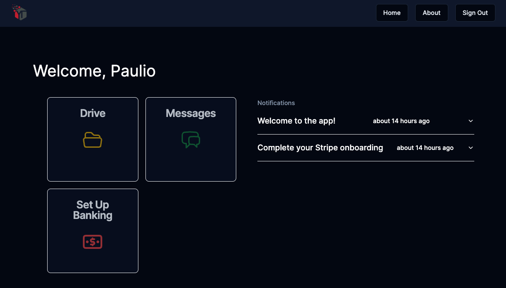
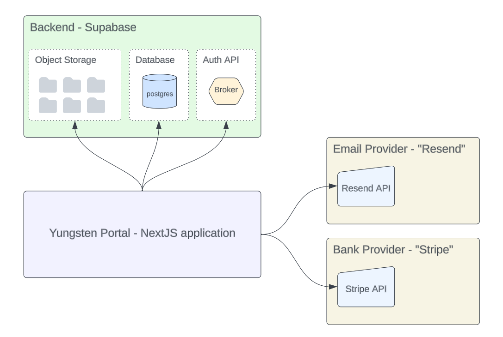
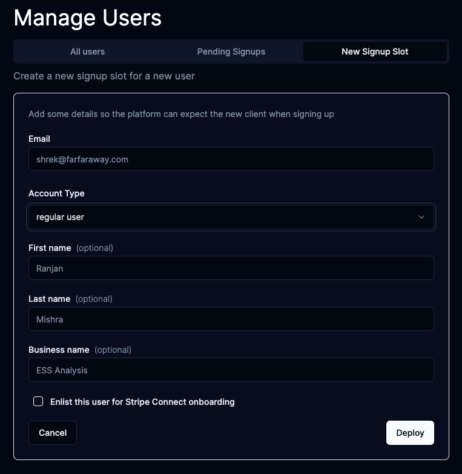

# Yungsten Portal
<div width="100%" style="display: flex; justify-content: center; align-items: center;">
    
</div>

### An interactive web platform for the Yungsten Tech team to interact with customers
Some Features:
- Private File-Drive support for every customer
- Invite-Only, customized signup experience for every client
- Stripe Connect integration and onboarding
- Yungsten Team administrator logins
- App notifications system
- Works on Desktop and Mobile! (mostly)

## How to run the app locally
There are three steps to running the portal locally on your machine:
- Clone this project with `git clone`, and install all the depdencies in this project folder with `npm install`.
- Create a `.env` file in this project folder (this file is not included on GitHub), and copy the contents of the `local.env` file to the `.env` file.  Ask a Yungsten Tech administrator for the secret values to put in there.
- Run the code with `npm run dev`, which should boot the portal on `http://localhost:3000`


## Application Information

### 👉 What APIs and services does the Portal use?
The Portal uses the following APIs and services to function:
- **Supabase Object Storage** to place "blobs" in (aka binary data).  We read the blobs in this storage API in a special way to re-create the feeling of a "drive" for clients in the portal.  
> for example, Supabase Object storage has no sense of folders, this is a UI experience we need to manually create by reading the Supabase Object storage API in a special way.

- **Stripe** is used for signing up client for automated banking services.  Specifically, we use [Stripe Connect](https://stripe.com/connect) to do this.
- **Resend** is used for sending emails, contact info, and files from a client's private drive.
- **Supabase Auth** is used for managing the authentication-related information for users.  The Yungsten Portal also has its own database, where we store our own information about users, but the Supabase Auth provider does the heavy-lifting of providing an API for us to call to do things like reset passwords, create new users, and more.
- **Supabase Database** is used for storing all the metadata and records for the Yungsten Portal.  This database's data-model is managed with Prisma.

Picture of how these services are grouped:
<div width="100%" style="display: flex; justify-content: center; align-items: center;">
    
</div>

### 👉 Invite Only?  What does that mean?
We don't want anybody to be able to come to this web application, sign up, and get access to all our features like the private drive, messaging, and more.  

To prevent this from happening, the application is structured so that a user will only be allowed to sign up if **_their email is on a pre-approved list_**.  This list can be edited by a Yungsten Portal administrator through the web-app.

As long as you are a super administrator on the portal (meaning your account type is called `Platform`), you will see a "Manage Users" card appear on your dashboard.  Click on this card, and you can select the tab to add a new expected signup to the platform.
This will add the email you enter to this whitelist.

There are some details that you as an administrator can fill out besides just the expected user's email, such as first/last name.  Though these fields are optional, it is good to fill them out, as it will provide a more customized and white-glove onboarding experience for the user when they come sign up, since those fields will be immediately recognized.

Demo screenshot of what creating a new slot for an expected user looks like:
<div width="100%" style="display: flex; justify-content: center; align-items: center;">
    
</div>

**If you create a "Super Admin"** account type, that user will have full administrator access when signing up, so be mindful if creating super admins!

### 👉 What does signing up for Stripe look like for clients?
The client's Stripe journey begins when you create the sign up slot for the expected client's email.
When you create rhat new expected sign up slot, you can see there is an option where you may select to `Enlist this user for Stripe Connect onboarding`.

If this option is checked, the account in our database will be automatically assigned special tag on the `AccountState` for the given user-model.   The `AccountState` will include the value:
```JSON
{
    "stripeJourney": "STRIPE_CONNECT_ONBOARD"
}
```
If this value is present when the user logs in, they will indeed see the "Banking" action card rendered on their dashboard.
When the user clicks on that home-dash action card, they will be brought into the [Stripe Connect Onboarding Flow](https://www.youtube.com/watch?v=xN79dwF-rOE&t=4s).

The client may or **may not** successfully complete the Stripe forms they need to fill out.  Because of this, there are several different scenarios the Yungsten Portal needs to handle when it comes to checking the validity of the client's connected Stripe account.

If the client successfully filled out all Stripe forms, when they click _"complete"_ on Stripe and are redirected back to the Yungsten portal, we will see the account marked as finished upon checking back with Stripe on the client's status.  
Given that we checked and Stripe says the client filled everything out, we will change the client's user's `AccountState` to the following behind the scenes:
```JSON
{
    "stripeJourney": "STRIPE_CONNECT_ONBOARD_COMPLETE"
}
```

On the other hand, if the client did not fill out all the Stripe forms, whether that be because they went to a different website by accident without finishing, did not want to give all details, or simply wanted to come back later, the Yungsten Portal will read how far-along in the process our client is, and reflect the needed actions that user will need to take in the user interface.
> NOTE: there is still a good bit of work that needs to be done for reflecting accurate telemetry from Stripe back to the client within our user interface.  This work is being done right now.

Either way, when the client is enlisted in Stripe through our platform, we will have a `stripeAccountId` for that user listed in our database, and we can use that `stripeAccountId` field to facilitate transactions and banking of behalf of their newly created Stripe account.

> NOTE: this new Stripe account that our client is creating is different from their "main" Stripe account, if they even have one.  The Stripe account that our client is creating here is called a "Connected Account", and exists only under the domain of our larger "Yungsten Tech" Stripe account.  Think of our client's Stripe account as a child to our main account.